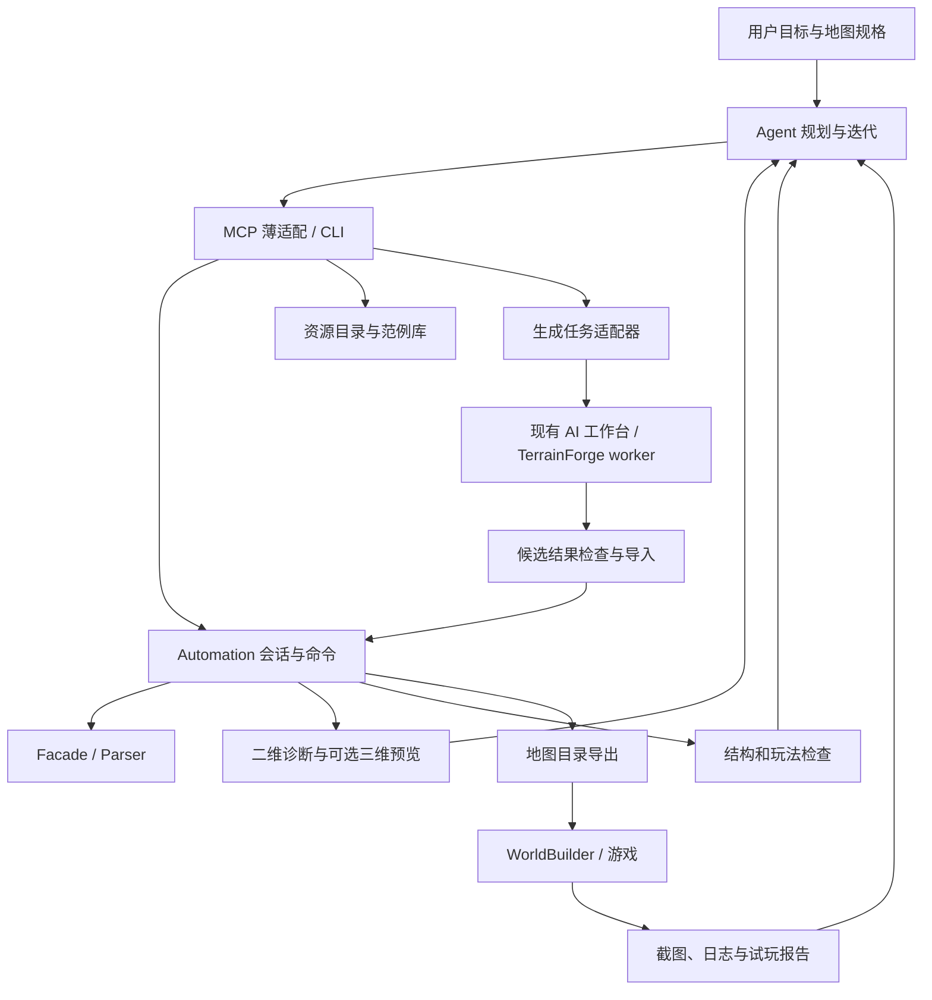

# Agent 制作 RA3 地图：可行性与开发路线

日期：2026-09-16。依据当前工作区（包括未提交的 Automation 代码）进行静态扫描，并运行 Automation 独立回归测试。本文是开发方案，不代表各项能力已上线。

范围更新：按用户要求，水域和灯光采用默认配置，不开发其编辑命令，也不把相应解析补全列为前置条件。新地图沿用默认资产，已有地图保留原资产；默认海平面下的海岸形状由地形高度决定。详细接口、数据和实施拆分见 [详细设计](Agent-Map-Creation-Design.md)，与本文不一致处以详细设计为准。

## 1. 判断与首版目标

2026-09-17 更新：用户明确不需要真实游戏加载验证。游戏启动/试玩不再是本项目的验收前置；以静态检查、文件与历史可靠性、完整导出及真实编辑器预览验收，下文早期游戏验收安排据此调整。

可行，已有基础足以进入工程实现。推荐“结构化编辑 + 程序化布局 + 可选生成模型 + 视觉反馈 + 游戏验收”的混合系统。

目标体验是：用户描述地图 → agent 检索素材和范例 → 给出空间布局 → 生成地形 → 放置玩法对象和装饰 → 查看地图及诊断 → 局部修正 → 交付可试玩地图。

首版建议限定一个游戏/Mod 配置、一种美术主题和双人遭遇战，先完成一张有出生区、资源点、主路和侧路的完整地图。复杂战役、跨 Mod 通用、新模型资产生产和完全自动平衡评测放在后续。原版与日冕使用不同资源配置，实施前须选定其中一个作为验收基线。

“优秀”需要同时满足：文件可靠、玩法合理、视觉统一、修改可控。地图能重新解析或高度图好看，都不能单独证明游戏中可玩。

## 2. 扫描范围及已验证事实

- `Ra3MapSharp`：Parser、Facade、Transform、Visualization、Lua、Automation，及关键测试与设计文档。
- `Ra3MapUtils`：旧 MCP 实现和新 `src/UI` MCP 注册；`src/Core/AiMaps`、`src/UI/Services/AiMaps`、`src/AiMapAdapter`；AI 工作台文档；知识库 DAO。
- `ra3_map_workspace`：目录与项目说明抽查、`RA3_AI_SDD_GUIDE.md`。没有逐一审计所有地图 Lua 或执行游戏。
- 没有运行生成模型、WorldBuilder、游戏或 MCP 端到端调用；不据此宣称这些链路已验收。
- 本轮验证：`dotnet test test/Dreamness.RA3.Map.Automation.Test/Dreamness.RA3.Map.Automation.Test.csproj --no-restore --filter 'TestCategory!=UsageExamples' --verbosity quiet`，55 项通过、0 失败。排除的 4 个 UsageExamples 未执行，其 TearDown 当前被注释；本轮不是全测试套件验证。

| 层/能力 | 代码事实 | 对本系统的意义 |
| --- | --- | --- |
| Parser/Facade | 可新建、读写地图；编辑高度、纹理、混合、对象、道路、路径点、玩家、队伍和脚本 | 精确地图编辑底座已存在，不需通过鼠标逐格操作 |
| Automation | 默认注册 12 个命令，执行器另支持 `batch.execute`；有工作副本、Revision、事务、撤销重做、请求去重、对象句柄及外部修改检测 | 可以继续扩展现有内核；不能把设计文档中所有计划命令视为已实现 |
| 已注册编辑命令 | 高度矩形设置/查询、路径点放置/移动/删除；地图创建/打开/信息/保存/另存；撤销/重做 | 普通对象、纹理、道路、资源检索、预览、完整验证、dry-run 尚需封装 |
| Transform | 存在旋转、缩放/尺寸调整及对称代码 | 有算法起点，但需要独立验证各资产的保留与变换语义 |
| Visualization | `GetPreviewImage()` 是高度着色 PNG，水位常量 200，固定翻转 Y | 尚不是对象/纹理预览，更不是游戏渲染 |
| MCP | 新 UI 中已有本地 HTTP `/mcp` 和程序集工具发现；提供 C# 执行、反射查询、Lua 与地图文件管理 | 可以添加薄适配层；本次工具列表未提供可直接调用的 RA3 connector |
| AI 地图工作台 | 有直接生成、语义草图、续画、草稿持久化、候选历史、取消、导出和模型/运行时检查代码 | 应复用为地形候选供应器，避免重造推理工作台 |
| 生成服务 | 有 ONNX worker 和区域 PyTorch worker 两条路径；普通生成计划显式关闭对象与峭壁生成 | 地形生成不能替代完整关卡制作；适配需要区分 runtime API |
| Lua/知识库 | 有 Lua 4 语法检查、导入方案；知识库有 SQLite FTS 搜索基础 | 复用玩法编写流程；语法通过不能证明引擎 API、同步和胜负行为正确 |

关键入口：

- [Facade](../src/Dreamness.RA3.Map.Facade/Core/Ra3MapFacade.cs)、[TilePart](../src/Dreamness.RA3.Map.Facade/Core/Ra3MapFacade/TilePart.cs)、[ObjectPart](../src/Dreamness.RA3.Map.Facade/Core/Ra3MapFacade/ObjectPart.cs)。
- [命令注册](../src/Dreamness.RA3.Map.Automation/Executor/CommandRegistry.cs)、[执行器](../src/Dreamness.RA3.Map.Automation/Executor/CommandExecutor.cs)、[会话历史](../src/Dreamness.RA3.Map.Automation/Session/MapSession.History.cs)。
- [预览](../src/Dreamness.Ra3.Map.Visualization/Extensions/PreviewExtension.cs)、[解析分发](../src/Dreamness.RA3.Map.Parser/Asset/Util/AssetParser.cs)。
- 相邻仓库：`Ra3MapUtils/src/UI/App.xaml.cs`、`src/UI/MCP/`、`src/UI/Services/AiMaps/AiMapGenerationService.cs`、`src/Core/AiMaps/AiMapContracts.cs`、`docs/ai-map-workbench.md`。

旧 `Automation-Design.md` 顶部已更新实现状态，但能力表仍称 Automation 为空类，应在后续维护时统一。相邻仓库也同时保留旧工程和新 `src` 工程，集成以实际打包入口和运行时程序集版本为准。

## 3. 必须优先验证的底层风险

1. **通行性不是成熟寻路判定。** `BlendTileDataAsset.UpdatePassabilityMap()` 用 `Math.Tan(45)`，API 参数是弧度；如果目标是 45 度阈值，需要角度转换。它还边扫描边标记邻格，后续格可能覆盖此前标记。先补有预期结果的坡度、边界及遍历顺序测试，再修正；不要把该函数直接作为可玩性评分器。
2. **默认环境资产要保持不变。** `StandingWaterAreas`、`GlobalLighting` 的结构化解析暂不扩展。新地图使用默认资产，已有地图按原始资产保留，回归检查编辑前后的资产 payload；不将它们的可编辑性作为前置条件。已有地图若不匹配默认环境，水面预览和相关静态分析须标注未知。
3. **完整地图变换有资产丢失风险。** `RotateTransformCommand` 创建边界为 0 的新图并复制地块和对象，没有完整复制玩家、队伍、脚本等流程。还需验证混合方向、水域多边形和脚本坐标。首版优先在设计布局上做对称，再生成地图。
4. **路径、坐标和量化要使用唯一规则。** 保留 Automation 的 `playableGrid/mapGrid/world`；区分格心和格角，10 世界单位/格，明确边界和图像 Y 翻转。高度以实际序列化值为准。Parser 的 SaveAs 不更新源路径，不能绕开 Session 保存策略。
5. **程序集可能不是同一版本。** Ra3MapSharp 为 net6.0，新 UI 为 net10.0-windows，现有工具有固定 DLL 引用，AI Adapter 又使用 TerrainForge。必须固定依赖与格式兼容矩阵；新宿主可引用兼容类库或经进程协议调用，不把 net10 依赖反向引入 net6 内核。
6. **并发写入和崩溃恢复仍需专门验收。** 现有去重表在内存中，不能承诺跨进程重启 exactly-once；文件事务回滚测试也不等价于断电原子性。生成器、Automation、编辑器必须有明确的写入交接。
7. **资源识别缺口。** 纹理枚举、脚本声明、搜索 DAO 不等于完整素材目录。本轮没有找到可直接供 agent 使用、带对象缩略图与占地信息的完整检索服务。

## 4. 架构与职责

Agent 决定主题、空间关系和修改策略；算法执行地形雕刻、道路、散布、对称与指标计算；生成模型提供候选；WorldBuilder/游戏提供真实反馈。

推荐扩展现有 Automation；在 Ra3MapUtils 新 UI 的 MCP 宿主增加工具；将生成器适配与 UI 控件解耦。仅在确有无界面部署需求时再做独立 MCP 宿主，避免两个不同的命令内核。

每张图保存一个独立设计规格：游戏/Mod 版本、尺寸、主题、出生区、资源区、路线图、水陆区域、禁建/保护区、seed、资源版本、验收指标。设计规格描述意图；真实 Session 快照描述已经实现的地图。二者通过 Revision、内容哈希和实现报告关联，不能把“规划了”当作“已生成”。

### Computer use 的位置

用于打开/重载地图、选择观察相机、截图、检查编辑器警告、启动试玩，以及少量尚无 API 的操作。重复、大范围、需精确坐标的编辑走命令。

理想桥接接口为 `open_map`、`reload_map`、`set_camera`、`capture_view`、`get_status`；这是拟议接口，当前未确认 WorldBuilder 插件已有这些能力。先调查插件 API；缺少时用 Windows UI 自动化适配。当前会话的浏览器控制工具未开放原生桌面控制，不能据此宣称已经能操作 WorldBuilder。

采用显式交接：Automation 导出指定 Revision → 编辑器打开副本 → 采集同版本截图。编辑器若修改并保存，先检测外部变化，再导入新版本。避免两边同时写一个文件。

### 视觉反馈分三级

1. **优先：二维诊断图。** 高度、坡度、纹理、默认海平面下的水陆示意、对象占地、出生/资源/道路、通行/禁建覆盖层；全图总览加局部裁剪。返回 Revision、图层、图例、坐标映射和问题位置。未识别环境配置的旧地图不声称水面准确。
2. **随后：轻量三维。** 高度网格、纹理和对象代理模型；固定俯视/斜视相机，支持点选到世界坐标。可用 Three.js，但它是工作预览，材质、模型和光照一致性需要另外开发。
3. **真实验收：编辑器/游戏截图。** 核对岸线、混合、对象高度、装饰遮挡与画面风格，结合游戏中寻路和建造行为。

MCP 工具结果可以携带图片和结构化数据，因此预览应直接返回可被客户端消费的图片，而不只返回本机文件路径；需实测目标客户端是否把图片提供给模型。协议依据：[MCP Schema](https://modelcontextprotocol.io/specification/2025-11-25/schema)。Three.js 的渲染能力依据：[WebGLRenderer](https://threejs.org/docs/pages/WebGLRenderer.html)。

## 5. 让 agent 真正有创作能力的增量

### A. 素材目录与组合件

先手工整理一个主题的小而可靠的目录：对象 typeName、中文/英文标签、Mod 版本、用途、尺寸/碰撞占地、地面/水面约束、可用高度/朝向、缩略图、来源及验证状态。未知占地明确标记，不能猜测后当作硬约束。

从现有地图提取只能证明“曾被使用”，最终有效性还需匹配目标游戏资源。素材检索返回少量候选及图册，支持“找适合海岸的岩石”等查询。组合件可表示矿区、基地入口、村落、港口；附带适用坡度、路线留空区和资源引用。首版可从验证过的地图片段抽取。

### B. 语义编辑与程序化生成

在现有命令上增加：多边形/圆形区域、平滑、坡道、纹理绘制与混合修复、普通对象放置/移动/删除、道路、玩家出生设置、资源组合件、受约束散布。

高层指令应能表达“保持主路畅通，在两侧布置稀疏树林”，由算法处理采样、间距、占地、坡度和保护掩码，而非让 LLM 输出几千个坐标。seed、算法版本与资源配置需要固定；Redo 恢复记录结果。

优先顺序：玩法拓扑 → 基地平台/路线/资源区 → 地形细节 → 材质 → 装饰。模型生成结果与玩法硬约束冲突时，拒绝候选或进行明确的局部修复；不能用模型输出悄悄改掉出生和路线约束。

### C. 现有生成器的接入

通过 `generation.start/status/cancel/results` 这类任务接口暴露异步生成。输入冻结的规格、语义图、保护掩码和版本配置；输出候选地图、预览、指标和日志引用。

UI 服务目前承担部分 worker 编排，可提取共享应用服务供 UI 与 MCP 调用，不要求 agent 操作绘图界面。需要给草稿层增加程序化写入入口，复用其持久化和约束校验。

候选导入时核对任务起始 Revision；会话已改动则拒绝直接覆盖。先对候选做格式和未编辑区域保留检查，再作为一次事务应用。对象、脚本、水域等不应因为地形重建而被重置。

模型未部署或生成失败时仍支持模板 + 确定性地形工具。模型质量与运行环境是独立依赖，不能阻断基础制图闭环。

### D. 评测与修复

检查分四类：

- 结构：重载成功、无解析错误、资产及引用有效、对象句柄唯一、未修改资产保留、地图目录附属文件齐全。
- 空间：越界、重叠、漂浮/埋地、道路中断、保护区变化、纹理突变。
- 玩法：分陆地/海军/两栖移动类别估算连通性与净宽；基地可建面积；到资源和交战区的最短路径、资源配置差异。静态估算只能作为代理指标，需游戏抽测校准。
- 美术：主题一致性、材质过渡、装饰疏密、地标辨识和战斗区域清晰度。自动打分辅助筛选，固定镜头人工对照决定是否达到优秀。

错误报告必须包含严重度、规则版本、坐标/区域、相关对象及修复建议。通过“观察 → 局部修改 → 复查”迭代，设置候选数/迭代预算，仍未达标时交付问题报告。

## 6. 最小工具面（新增名称为设计示例）

| 工具组 | 输入/输出重点 | 状态 |
| --- | --- | --- |
| `capabilities` | 命令 schema、资源配置、版本和限制 | 新增 |
| `map.create/open/info/save/save_as` | Session、Revision、保存目标 | 内核已有 |
| `assets.search/get` | 标签、缩略图、版本、占地 | 新增 |
| `map.inspect/preview` | 区域、图层、图片、坐标映射、Revision | 新增 |
| `batch.execute`、`history.undo/redo` | expectedRevision、requestId、事务结果 | 内核已有 |
| `terrain.* / texture.* / objects.* / prefab.*` | 区域与规则，返回实际修改范围 | 高度/路径点已有，其余增量 |
| `generation.*` | 后台任务、候选及受控导入 | 复用工作台后适配 |
| `map.validate` | 结构/空间/玩法问题及局部定位 | 新增 |
| `editor.* / playtest.*` | 地图版本、截图和运行报告 | 桥接探针成功后增加 |

大数组通过带哈希的文件/资源引用传递；避免把整个地图或所有程序集反射信息塞进上下文。C# 脚本执行可保留给实验扩展，但生产修改应进入同一事务与结果检查路径。

## 7. 开发阶段与验收门槛

估算为熟悉仓库的一名开发者的有效人日；依赖素材整理、插件接口和生成组件可用性，不是承诺工期。

| 阶段 | 工作与产物 | 验收门槛 | 估算 |
| --- | --- | --- | --- |
| P0 基线与桥接探针 | 选定游戏配置；5–10 张有代表性的测试图；固定 DLL/worker 版本；修正通行性算法；调查编辑器打开/截图路径 | 格式往返、未改资产保留、坐标锚点与基础寻路样本通过；至少一张图在 WB/游戏打开 | 3–5 天 |
| P1 可观察编辑闭环 | MCP 适配现有命令；二维分层预览；对象/纹理编辑；最小资源目录；结构检查 | agent 创建或打开图，编辑、看图、纠错、撤销和导出；局部图与真实坐标对应 | 5–8 天 |
| P2 完整可玩原型 | 基地/资源组合件；坡道/道路/散布；布局规格；连接现有生成任务及保护掩码 | 一种主题的双人地图完成装饰与玩法对象，游戏加载、出生、采矿、通路、建造和结束行为人工验证 | 8–12 天 |
| P3 质量闭环 | 连通性/净宽/经济距离报告；固定镜头截图；局部修复；少量高质量范例 | 多个 seed 和不同需求都能产出可解释结果；人类能按统一量表比较视觉/玩法质量 | 8–15 天 |
| P4 扩展 | 三维预览、更多主题/组合件、Lua 玩法模板、进一步 UI 自动化与性能优化 | 多场景回归；实测大图开销与失败恢复；按目标地图类别补试玩 | 单独估算 |

P0 与 P1 是最先投入的范围；P2 结束才有资格声称能完成“完整地图”。P3 才主要解决“优秀且稳定”。不要等完整三维渲染器做完才接 agent，也不要把高质量完全寄托于重新训练模型。

首个端到端示例规格：一个已验证主题、两处对称基地、主路和侧路、明确资源组、可建平台、装饰保护通道；尺寸选择已部署生成器实际支持的尺寸，或者直接使用已验证模板。当前工作台文档的主路径限制为 256–800、4 的倍数、正方形，不应把这个限制误认作 RA3 文件格式本身限制；区域实验运行时另查能力。

## 8. 验证与交付

每阶段交付地图文件/目录、设计规格、资源/模型/算法版本、操作记录、分层预览、验证报告及真实试玩记录。复制模板与导出时显式管理 `map.str`、脚本和其他附属文件；只保存 `.map` 不等于完整地图包。

自动测试优先覆盖：事务失败恢复、旧资产保留、版本冲突、坐标往返、对象占地约束、保护区不变、相同输入的确定性算法结果、候选导入后重载。神经网络跨设备输出不承诺逐字节一致，记录实际候选与哈希。

性能用代表性尺寸实测：加载/保存时间、峰值内存、快照增长、预览延迟和每轮生成开销。确认完整快照成为瓶颈后再引入分块增量；先避免逐格 RPC 和全量图像重复返回。

真实游戏验收至少覆盖：双方出生、资源使用、基础建造、各移动类别的关键路线、AI 或玩家对战流程；自定义 Lua 地图增加触发器、胜负与多人同步验证。通过次数和标准应写入对应模板，而不是只记录“游戏能打开”。

本轮仅新增本文档，保留原有未提交代码和设计文件；未实施上述新增功能。
