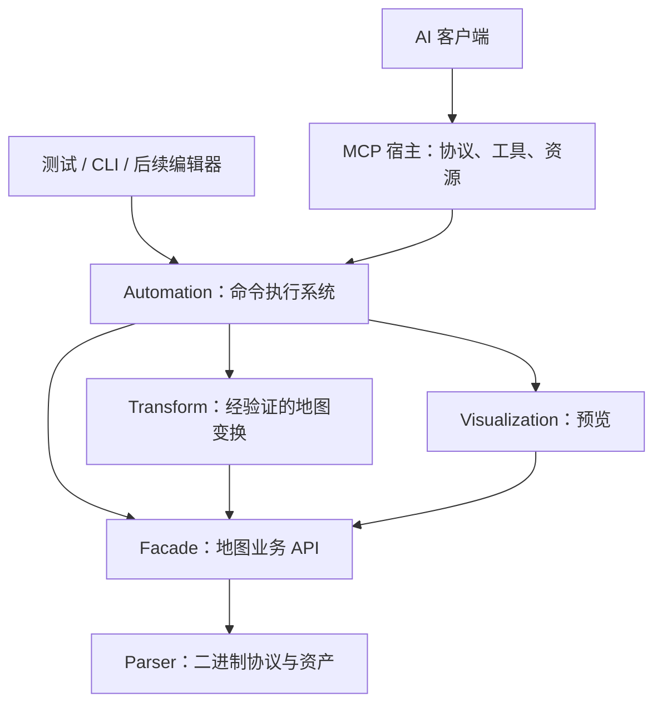

# RA3 AI 地图自动化：可行性与命令执行系统设计

日期：2026-09-15；实现对照更新：2026-09-16。状态：分阶段实现中，本文仍包含未实现的规划。未进行游戏内验证或性能测量。

当前已实现：会话与持久工作副本、基础地形/路径点命令、原子批次、历史、文件保存及相应回归测试。预览、资源目录、MCP 宿主、完整验证器和 dry-run 尚未实现。以下设计中的命令清单不代表当前可调用能力。

## 1. 结论与产品边界

方案合理且具备实现基础。建议把 `Dreamness.RA3.Map.Automation` 建成可独立调用、可测试的地图命令库，MCP 作为独立宿主接入。

第一阶段定位为“AI 辅助地图文件编辑器”：自然语言规划 → 查询资源与地图 → 批量编辑 → 查看预览与检查报告 → 修正 → 导出 → WorldBuilder/游戏验收。AI 负责布局意图，确定性算法负责区域编辑、布置和校验。

这套系统可以复用游戏已有对象、纹理和地图格式；它本身不生成新的三维模型、游戏资产或渲染引擎。实时控制 WorldBuilder、自动启动游戏和游戏内截图属于后续适配能力，当前命令核心不依赖它们。

成功标准分三级：

1. **结构正确**：命令可回滚、文件能重新解析、资产引用有效。
2. **编辑可用**：WorldBuilder 能打开，地形、对象、玩家和脚本符合预期。
3. **游戏可玩**：游戏能加载，出生位置、资源、寻路和胜负逻辑正常。

一级通过不能替代二、三级；地图平衡性更需要人工试玩或后续评估器。

## 2. 当前代码提供的基础与缺口

以下路径相对仓库根目录。

| 能力 | 当前实现依据 | 对 Automation 的意义 |
| --- | --- | --- |
| 创建、打开、保存地图 | `src/Dreamness.RA3.Map.Facade/Core/Ra3MapFacade.cs` | 可直接封装，但保存策略需独立管理 |
| 地形高度 | `src/Dreamness.RA3.Map.Facade/Core/Ra3MapFacade/HeightPart.cs` | 已有单点读写，需增加矩形/圆形等区域操作 |
| 纹理、混合、通行属性 | `src/Dreamness.RA3.Map.Facade/Core/Ra3MapFacade/TilePart.cs` | 可封装批量修改；纹理邻域和通行数据更新要纳入事务 |
| 对象、路径点、出生点 | `src/Dreamness.RA3.Map.Facade/Core/Ra3MapFacade/ObjectPart.cs` | 已有增删查询，需提供稳定句柄、参数校验和批量布置 |
| 玩家、队伍、脚本 | Facade 中 `PlayerPart.cs`、`TeamPart.cs`、`ScriptPart.cs` | 玩家/队伍可复用；脚本目前偏整体 JSON 导入导出，细粒度编辑需补充 |
| 旋转、调整尺寸、对称 | `src/Dreamness.RA3.Map.Transform/Ra3MapTransform/Commands/` | 可由适配器调用，须先验证资产保留和坐标语义 |
| 预览 | `src/Dreamness.Ra3.Map.Visualization/Extensions/PreviewExtension.cs` | 当前是高度着色 PNG，水位判色固定为 200，并非真实游戏画面 |
| Automation | `src/Dreamness.RA3.Map.Automation/` | 当前只有空类及 Commands/Executor/History/Session 目录声明，无项目依赖 |

### 需要提前处理的具体问题

- `Ra3MapFacade` 构造时缓存多个 Asset 引用。仅替换公开的 `ra3Map` 字段会留下旧引用；恢复快照必须重建整个 Facade。
- 当前 `.map` 类型只有文件形式的 `Open`，没有完整的内存读写对称 API。`Context.ToBytes()` 不包含地图外层压缩标记，不能直接当完整地图文件使用。
- `Ra3Map.SaveAs()` 当前写文件但不更新 `MapFilePath`；新地图另存后直接 `Save()` 仍可能失败，已打开地图另存后 `Save()` 仍可能写回旧路径。Automation 的保存目标应由 Session 管理。
- `Ra3MapFacade.NewMap()` 默认用未指定种子的 `Random` 放置出生点。确定性建图应传入 `initPlayerStartWaypointCnt: 0`，再显式放置。
- `ObjectPart.cs` 明确考虑了名称和 `UniqueId` 重复的情况。不能把地图原有 ID 或名称当作唯一定位凭证。
- `RotateTransformCommand` 创建边界为 0 的新地图并复制地块及对象，没有完整复制玩家、队伍、脚本等资产的流程。不能直接对外承诺“完整地图无损旋转”。
- 高度通过 `ElevationDim2Array` 转为 SAGE 16 位表示写入文件；快照恢复可能产生量化。必须明确编辑结果以实际可序列化数值为准。
- 现有数据提供纹理枚举和脚本声明，但尚未在已审查代码中发现可直接供 AI 使用的完整对象类型检索服务。

## 3. 分层与依赖



- Automation 保持普通 .NET 类库，不依赖 MCP SDK、LLM SDK、提示词或特定模型。
- MCP 宿主建议另建 `Dreamness.RA3.Map.Mcp`，只负责协议映射、会话绑定和资源读取。
- 第一版 Automation 依赖 Facade、Visualization；Transform 在对应命令通过验证后接入。Parser 细节集中到快照/适配服务，避免散落在 Handler。
- 保持 Automation 的 `net6.0` 兼容性。MCP 宿主的目标框架和 SDK 版本在实施时单独核验并锁定；若需新 SDK，还需处理仓库 `global.json` 的 SDK 选择，不能只修改宿主 TargetFramework。
- 首版采用本机 stdio 宿主；日志写 stderr，stdout 留给协议消息。HTTP、多用户、远程访问后续再设计。

## 4. 目录与核心抽象

保留现有四个目录，在需要时增补服务目录：

```text
Dreamness.RA3.Map.Automation/
  Commands/
    Abstractions/       请求、描述符、Handler 接口
    Map/                创建、查询、验证、保存
    Terrain/            高度与区域操作
    Texture/            涂绘与混合
    Objects/            查询、放置、移动、删除、出生点
  Executor/             注册表、分发、校验、事务、去重
  Session/              会话、地图状态、坐标转换、对象句柄
  History/              快照、撤销/重做、命令日志
  Catalog/              对象类型、纹理、脚本声明检索
  Preview/              预览服务与产物描述
  Validation/           参数、结构、引用、布局检查
  Storage/              地图快照编解码、原子文件保存
```

建议的最小接口形状（示意，不是可直接编译的完整实现）：

```csharp
public interface ICommandExecutor
{
    Task<CommandResult> ExecuteAsync(
        CommandRequest request, CancellationToken cancellationToken = default);
}

public interface ICommandHandler<TArgs, TData>
{
    Task<TData> ExecuteAsync(
        CommandContext context, TArgs arguments, CancellationToken cancellationToken);
}

public interface ICommandRegistry
{
    IReadOnlyList<CommandDescriptor> List();
    CommandDescriptor Get(string name, int version);
}
```

`CommandDescriptor` 包含名称、版本、说明、输入/输出 JSON Schema、参数示例，以及执行器使用的 `Effect`（Query / Mutation / Session / History / Export）。另有事务适用性、资源上限等元信息。撤销支持由快照机制提供，不要求每个 Handler 实现反向操作。

请求在边界使用 JSON DTO，注册表分发后反序列化为强类型参数；不把 `Asset`、`ObjectWrap`、任意 C# 类型名或反射入口暴露为协议。初期显式注册 Handler，并验证命令名与版本无重复；不需要先做复杂插件发现系统。

参数 DTO 是运行时校验与 Schema 的共同来源；区域联合类型使用明确的 `kind` 字段。除基础类型约束外，地图边界、资源存在性等状态相关约束由验证器处理。

## 5. 命令协议

### 请求示例

```json
{
  "requestId": "req-0042",
  "sessionId": "session-a",
  "expectedRevision": 7,
  "command": "terrain.set_height",
  "commandVersion": 1,
  "arguments": {
    "region": {
      "kind": "rectangle",
      "space": "playableGrid",
      "x": 16,
      "y": 20,
      "width": 24,
      "height": 12
    },
    "height": 240,
    "passabilityPolicy": "rebuild"
  }
}
```

### 返回示例

```json
{
  "requestId": "req-0042",
  "sessionId": "session-a",
  "status": "succeeded",
  "revisionBefore": 7,
  "revisionAfter": 8,
  "data": { "affectedCells": 288 },
  "changes": {
    "heightChanged": true,
    "passabilityRebuilt": true
  },
  "warnings": [],
  "artifacts": [],
  "error": null
}
```

- 写地图、历史操作、保存必须携带 `expectedRevision`；查询返回读取版本。创建会话无需 sessionId 或 expectedRevision。
- 错误返回稳定的 `code`、中文/英文可读 `message`、`details`（字段路径、允许范围等）和 `retryable`，不让 AI 解析堆栈猜原因。
- 第一批错误码：`UNKNOWN_COMMAND`、`UNSUPPORTED_VERSION`、`INVALID_ARGUMENT`、`SESSION_NOT_FOUND`、`REVISION_CONFLICT`、`REQUEST_ID_CONFLICT`、`OBJECT_NOT_FOUND`、`UNKNOWN_RESOURCE`、`UNSUPPORTED_MAP_FEATURE`、`LIMIT_EXCEEDED`、`VALIDATION_FAILED`、`IO_ERROR`、`CANCELLED`。
- 每个会话按 requestId 去重：相同请求返回原结果，参数不同则报冲突。指纹包含命令、版本、参数和 expectedRevision。同一请求正在执行时等待同一结果，不启动第二次执行。
- 去重查询先于版本冲突检查，避免“执行成功但响应丢失”的重试被误判。缓存只保证会话存活期间有效，且原结果携带原 revision；重试后可查询最新地图状态。
- Query 结果分页、限量，并按 revision 缓存或失效；区域数据默认返回统计与预览，大矩阵单独导出。不要将整张地图 JSON 放进每次工具回复。

## 6. Session 与坐标约定

### 一个会话持有一张当前地图

`MapSession` 管理当前 Facade、单调递增 Revision、保存目标、最近保存内容哈希、历史游标、对象句柄表、资源配置和会话锁。内部地图对象不向外泄露；读命令返回脱离地图实例的 DTO。

首版同会话所有地图访问串行，包括查询和快照，避免 Parser 懒解析/缓存造成并发问题；不同会话可独立执行。建立明确的关闭与超时回收策略，删除临时产物但保留已导出文件。未保存关闭默认返回 dirty 状态，调用者通过明确 discard 参数执行丢弃。

### 三类坐标显式区分

| 坐标空间 | 约定 |
| --- | --- |
| `playableGrid` | AI 默认使用；可玩区域左下角为原点，X 向右、Y 向上 |
| `mapGrid` | 包含边界的底层数组坐标；`mapX = playableX + border`，Y 同理 |
| `world` | 对象使用的连续世界坐标；现有代码按 1 格 = 10 世界单位处理 |

矩形统一使用半开范围 `[x, x + width)`、`[y, y + height)`。对象按格放置时明确 `anchor: center` 或 `gridPoint`；中心点采用 `worldX = (playableX + 0.5) * 10`，Y 同理，不再加边界。坐标转换集中在一个服务中。

这是建议的 Automation 对外契约；实施前必须用带边界的非方形地图，在 WorldBuilder 验证底层对应关系、Y 方向以及地形采样点与瓦片中心的区别。不要依据预览 PNG 的像素坐标直接放对象。

对象高度使用显式 `zMode: absolute | terrain`，贴地模式明确采样方式与偏移值；MVP 可先只提供 absolute，待采样和游戏验证完成再开放 terrain。区域越界默认报错，显式 `clip: true` 才裁剪。高度、角度和坐标拒绝 NaN/Infinity，并校验格式可表示范围。

### 对象句柄

对外使用会话内唯一 `objectId`，原地图 UniqueId/名称只作为可查询属性。首次加载按精确对象实例建映射；新增对象返回句柄。快照同时保存句柄与序列化对象顺序的关联，恢复时重建并校验一一对应关系。不能只按可能重复的名称/UniqueId 恢复。

句柄跨本会话的编辑、撤销和重做保持一致；关闭后重新打开不承诺相同句柄。旋转等重建地图的操作必须提供对象对应关系，无法可靠映射时不开放该命令。批次内允许通过显式 `ref` 引用前序子命令创建的对象，禁止任意表达式求值。

## 7. 执行、事务和历史

### 写命令的标准流程

1. 解析和校验 Schema，解析命令描述符，定位会话。
2. 获取会话锁，检查 requestId 去重记录和 expectedRevision。
3. 检查资源、坐标、对象引用、地图能力和工作量上限。
4. 从当前完整快照恢复隔离的工作 Facade，Handler 只修改工作副本。
5. 完成命令及派生数据更新，执行相关结构和引用检查。
6. 序列化并重新打开工作副本，校验资产与句柄恢复；以格式可表示的规范化结果作为提交状态。
7. 在锁内发布新地图、历史记录、去重结果和新 Revision；成功结果此时才可返回。

任何提交前异常或取消均丢弃工作副本，不修改当前状态、不增加 Revision、不留下成功历史。提交点之后取消不能再报告为“未执行”；响应丢失时依赖 requestId 查询原结果。首版只有进程内事务保证，不声称进程崩溃后的持久事务恢复。

高度修改须声明通行数据策略：`rebuild` 调用已验证的派生更新，`preserve` 保留手工通行标记并返回可能过期的警告；后者不能声称地图寻路已正确。现有重建范围若为全图，就如实记录成本和影响，不能假装只改目标区域。

纹理自动混合涉及邻居，操作影响范围至少覆盖所需邻域。不要仅恢复中心格而漏掉混合表、纹理注册或邻居变化。

### 快照先行

MVP 使用完整二进制地图快照 + 会话对象映射。先把恢复正确性做好，再优化局部差量，不为每条命令手写 `Undo()`。

建议后续在 Parser 增加完整地图的 `FromBytes` / `ToBytes`，并在 Facade 增加相应工厂，复用已有 Open/Save 的格式逻辑。必须保留声明表和资产序列化顺序、压缩语义及未知资产原始数据。修改这些项目时按 AGENTS.md 补齐构建和测试。

如果第一轮只允许修改 Automation，可先使用私有临时目录的 SaveAs/Open 快照适配器；隔离临时路径与用户保存目标。该方式需要测量磁盘开销，不能作为未经测量的高性能方案。

只在打开/创建时建立基线快照，之后提交规范化快照。高度量化应进入 API 返回与容差测试；对于已打开地图，先验证未修改保存的语义保持情况，遇到不支持资产采取能力限制，不能静默丢失数据。

### Undo / Redo

- 历史以已提交编辑事务为单位；批量编辑记一条历史。
- Undo/Redo 恢复快照和句柄表，移动历史游标，但 Revision 始终递增。例如 revision 8 撤回内容后变成 9，不能回到 7。
- Undo 后进行新编辑，清空可重做分支。
- 查询、预览、失败请求不进入撤销历史。导出不进入地图撤销历史，Undo 不删除或回写已导出的文件。
- Dirty 通过当前规范化内容与最近保存内容比较，不能仅用 revision 是否相同判断。
- 快照按总字节预算与步数共同限制，提交前预留内存；撤销范围被裁剪时明确返回。长期命令审计日志与可撤销历史分开。

### Batch 与 dry-run

`batch.execute` 首版只支持同会话、顺序执行、全有或全无的地图修改命令，不嵌套，不混入 Save/Close/Undo 或其他外部副作用。子命令在前序结果形成的工作副本上依次校验，不能只对初始状态统一校验。整个批次只取一次快照并增加一次 Revision；失败返回子命令索引。

`dryRun` 使用同样的工作副本执行和验证，但不提交地图、历史或持久文件；返回预计影响和临时预览，并明确资源成本可能接近真实执行。随机命令必须给 seed，并记录算法版本；dry-run 后执行还需要 expectedRevision 匹配，不能保证期间状态未变化。

## 8. 命令范围与 AI 使用体验

### 第一版命令族

| 类别 | 建议命令 | 说明 |
| --- | --- | --- |
| 会话 | `map.create`、`map.open`、`map.close` | 创建/返回 sessionId；open 使用配置的工作目录 |
| 查询 | `map.info`、`terrain.query`、`objects.query` | 摘要、区域统计、分页对象 DTO |
| 资源 | `catalog.search`、`catalog.describe` | 分类检索纹理、对象类型、模板及能力状态 |
| 地形 | `terrain.set_height` | 先实现矩形/圆形批量设置 |
| 纹理 | `texture.paint` | 区域涂绘，可显式请求自动混合 |
| 对象 | `objects.place`、`objects.move`、`objects.delete` | 支持数组参数与结果句柄 |
| 出生点 | `players.set_start` | 校验玩家索引和命名；已有重复出生点须报歧义 |
| 反馈 | `map.preview`、`map.validate` | PNG 与分层检查报告 |
| 编排 | `batch.execute`、`history.undo`、`history.redo` | 统一调用执行器 |
| 导出 | `map.save_as`、`map.save` | 原子文件提交及会话保存目标管理 |

不必一次实现全部命令。最先贯通 create → set_height → preview → undo/redo → save_as → reopen，再补齐对象与资源闭环。

AI 不应该发出几万条单格调用来造山、画河、种树。后续补充 `terrain.raise`、`terrain.smooth`、`terrain.ramp`、`objects.scatter`、`layout.mirror` 等可解释的区域算法；随机布局使用固定 seed，返回实际放置数、跳过数及原因。

“生成双人海岛地图”属于可组合配方或上层规划，不应成为唯一黑盒命令。配方最终展开为可审查的版本化命令序列。水域生成需同时处理真实水资产、地形、岸线和通行语义，不能只把高度降到 200 以下。

### 资源目录是必要能力

模型先检索再引用真实资源 ID。目录记录 ID、类别、显示名/别名、标签、来源、适用游戏或 Mod 配置、验证状态；支持按用途搜索并限制返回条数。首版可维护小型、经过 WorldBuilder 验证的目录，之后再增加游戏数据导入。

地图里出现过某个类型、枚举中有某个名称，不等于当前游戏或 Mod 一定支持它。离线验证区分“名称已登记”和“目标游戏已验证”，缺少依据时返回 unknown，不把写入任意字符串视为验证成功。

## 9. MCP 适配

内部只有一个 Executor，外部建议开放一组按任务组织的强类型工具，例如 `ra3_map_create`、`ra3_map_info`、`ra3_terrain_set_height`、`ra3_objects_place`、`ra3_map_preview`、`ra3_batch_execute`。

常用工具保留完整参数 Schema 和示例，比一个只接收任意 JSON 的 `execute` 更利于模型发现和正确调用。命令 Registry 可以生成工具描述，但须显式标注哪些命令允许暴露；后续命令很多时再加入 discover/describe/execute 入口，不提前牺牲基础工具的类型信息。

MCP 可以用 `structuredContent` 和输出 Schema 返回结构化结果，用图片内容或资源链接交付预览。业务失败映射为工具结果 `isError: true`，协议错误留给协议层。参见 [MCP Tools 规范](https://modelcontextprotocol.io/specification/2025-11-25/server/tools) 和 [官方 C# SDK](https://github.com/modelcontextprotocol/csharp-sdk)。实施时锁定所支持的协议版本，不追随未固定的 draft。

首版预览直接返回适当分辨率的 PNG，使不支持自定义资源读取的客户端也能看到结果；可选资源 URI 如 `ra3://sessions/{sessionId}/revisions/{revision}/preview.png`，必须由宿主实现读取、过期和会话访问检查，不能只返回一个无法打开的路径。

预览应带坐标、可玩边界、对象/出生点叠加、图例和 revision，标明 `height-schematic` 等视图类型。地形颜色、纹理示意图和真实游戏截图分开标识，避免 AI 依据假水位或假材质进行判断。

MCP request ID 与领域 requestId 分离，跨连接重试仍须沿用领域 requestId。会话由宿主绑定客户端所有权；标记某工具是只读只是描述信息，服务端仍按注册元信息执行约束。

## 10. 保存与验证

### 保存

- 当前 `map.create` 要求父目录与地图名，创建用户文件后打开工作区；`map.save` 保存到该工作区固定的用户文件，不依赖 Parser 的来源路径副作用。
- `map.save_as` 导出拷贝，不切换当前工作区或其保存目标，也不清除源工作区的 Dirty。目标恰好为当前用户文件时，显式 overwrite 后按 `map.save` 处理。目标为其他正在打开的工作区时拒绝覆盖。
- 保存先生成并回读候选地图，再通过目标同目录的唯一临时文件替换。保存元数据一并提交；发生异常时恢复已替换文件。当前保证进程内失败回滚，不保证进程崩溃、断电或底层存储失效时的多文件原子性。
- `LastSavedContentHash` 保持为用户文件字节哈希，用于检测外部改动；新增 `LastSavedMapHash` 为不含压缩封装的序列化内容哈希，用于 Dirty 判断。旧工作区在验证来源文件未变化后补齐该字段。
- 文件压缩默认 true，允许显式覆盖。MVP 保存范围为 `.map`；目录包、缩略图和额外文件须另立契约，不能把多个文件写入声称为单文件原子操作。
- 同进程不同会话保存同一路径时使用目标路径锁；覆盖前比较已知文件哈希，外部改动返回冲突。外部程序不遵守该锁的并发写入无法完全防止，应在产品流程中避免同时保存同一文件。
- 工作区路径规范化，拒绝目录穿越及指向配置范围外的链接；大小、对象数、批次长度、输出尺寸和快照总量有可配置上限。不提供任意 shell/C#/Python 执行作为基础地图工具。

### 验证报告

返回每项的 `checkId`、`severity`、`status: passed | failed | unknown | skipped`、对象/区域和修复建议，区分：

1. 参数与格式：数值范围、数组尺寸、必要资产、声明表与资源引用、序列化回读。
2. 编辑结构：出生点重复/越界、玩家队伍引用、纹理混合引用、脚本声明与参数。
3. 地图布局：出生点距离、资源分布、坡度及通行栅格连通性等近似检查。
4. 引擎行为：WorldBuilder 打开、游戏加载、实际寻路与脚本执行，首版报告 unknown/需人工验收。

按修改范围执行事务内检查，完整验证由 `map.validate` 或导出执行。真实道路连接、桥梁、两栖单位、建筑阻挡和水域逻辑，不能仅靠栅格连通性推断。

## 11. 分阶段交付与验收

### P0：先验证关键假设

- 小型非方形带边界地图：校验格子、对象、PNG 坐标一致性。
- 新地图和代表性现有地图：完整快照回读，重复对象 ID、未知资产和高度量化验证。
- 明确保存目标行为与覆盖失败处理。
- 测量不同尺寸地图的快照体积、峰值内存、序列化时间和预览耗时；据此定配额，不预先承诺毫秒级交互。

### P1：最小可靠闭环

实现 Session、Registry、Executor、SnapshotHistory，以及 create/info/set_height/preview/undo/redo/save_as/open。新增独立 Automation 测试项目，所有自动化测试用程序生成地图与临时目录，不依赖用户 RA3 Maps 文件夹。

验收：创建地图 → 批量修改高度 → 预览 → 撤销/重做 → 保存 → 重开后读取到对应的规范化数据；注入中途失败时地图、Revision、历史都不变。

### P2：AI 真正能编辑地图

增加纹理、资源目录、对象、出生点、原子批次、校验和 MCP stdio 宿主。制作一个显式出生布局的双人地图样例，进行 WorldBuilder 与游戏人工验收；记录游戏版本和所用资源配置。

### P3：生成效率与复杂编辑

增加地形笔刷、坡道、可复现散布、对称布局、细粒度脚本。整图 Transform 需逐项验证资产保留、对象映射、方向性混合与脚本坐标，未满足要求时返回能力不支持。

### P4：反馈与性能增强

真实编辑器/游戏截图适配、材质预览、局部差量历史、持久恢复、后台长任务和更强布局评估。仅在实测单次命令超过交互预算后引入任务队列与进度协议。

### 自动化测试重点

- 无效区域、资源不存在、旧 Revision：零状态变化。
- 批次后半段失败或取消：前半段无残留；批次创建对象引用正确。
- requestId 重试：对象只创建一次；同 ID 不同参数拒绝。
- 两个同版本写请求：最多一个提交，另一个版本冲突。
- 重复原始 UniqueId：移动/删除只影响指定句柄；撤销重做保持映射。
- 序列化失败：当前状态与历史不变；保存失败：原文件及会话保存目标不变。
- Undo 后新编辑：Redo 分支清空；Undo/Redo 的 Revision 单调递增。
- 预览版本、坐标与实际数据一致；干跑不修改会话或用户文件。
- 同 seed + 算法版本 + 输入快照/资源配置：生成位置一致；由历史 Redo 恢复结果，不重新随机执行。

文档本次不触发代码测试。后续修改 Automation 执行其构建与独立测试；修改 Parser/Facade/Visualization 时同时执行 AGENTS.md 对应验证。游戏内可用性另行验收。

## 12. 推荐决策摘要

采用“独立命令类库 + MCP 薄适配”；首版以完整快照、串行会话、强类型区域命令和结构化反馈为核心。把资源检索和预览作为必需能力，与编辑共同交付。先实现可回滚、可重复、可检查的小闭环，再扩展高级生成与实时编辑器集成。
